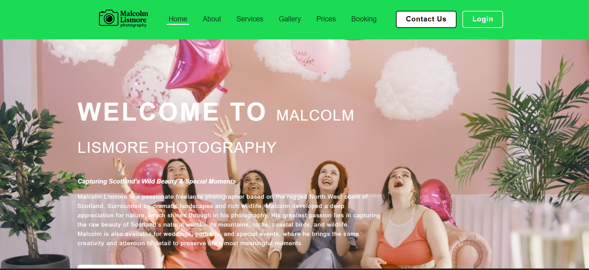

# Malcolm Lismore Photography Website

This responsive multi-page photography website. That project was created to showcase photography services, gallery management, customer booking, and user interaction features using front-end and back-end web technologies.

---

## 📌 Project Overview

The Malcolm Lismore Photography Website is designed to provide users with an interactive platform to explore photography services, view image galleries, make bookings, and contact the photographer online.

The website includes both user-side pages and admin-side management pages.

---

## 🚀 Features

### User Features
- Responsive Home Page
- About Page
- Services Page
- Gallery Page
- Prices Page
- Booking System
- Contact Form
- User Login & Registration
- Interactive UI Design
- JavaScript Validation

### Admin Features
- Admin Login
- Admin Dashboard
- Manage Bookings
- Manage Contact Messages
- Manage Users

---

## 🛠️ Technologies Used

- HTML5
- CSS3
- JavaScript
- PHP
- MySQL

---

## 📂 Project Structure

```bash
├── admin/
├── css/
├── images/
├── js/
├── videos/
├── index.html
├── about page.html
├── services page.html
├── gallery page.html
├── prices page.html
├── booking page.html
├── contact page.html
├── login.html
├── register.html
├── booking.php
├── contact.php
├── login.php
├── register.php


💻 System Functionalities

Customer registration and login
Online booking management
Contact message handling
Dynamic form processing using PHP
Responsive design for different devices
Admin panel for system management


🎯 Objectives

Develop a professional photography website
Improve user experience through responsive design
Implement client-server communication
Apply front-end and back-end web development concepts
Demonstrate database integration and form handling


🧪 Testing

The system was tested using,

Functional Testing
UI Testing
Form Validation Testing
User Acceptance Testing


👩‍💻 Developed By
Tharushi Prabodhini


